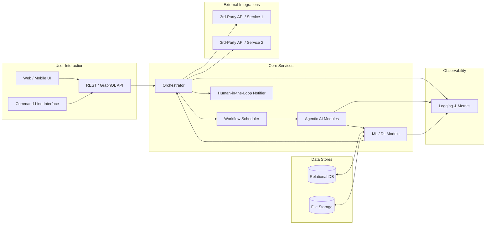
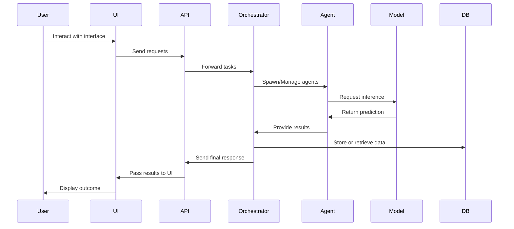

[](#)

# AutonoAI

> **An autonomous AI system capable of managing complex workflows, making decisions, and performing tasks with minimal human intervention.**

[](LICENSE)
[](https://github.com/iamvisheshsrivastava/AutonoAI/stargazers)
[](https://github.com/iamvisheshsrivastava/AutonoAI/network)
[](https://github.com/iamvisheshsrivastava/AutonoAI/issues)

---

## Table of Contents
1. [Introduction](#introduction)
2. [Key Features](#key-features)
3. [Technology Stack](#technology-stack)
4. [Architecture](#architecture)
5. [Use Cases](#use-cases)
6. [Installation](#installation)
7. [Quick Start](#quick-start)
8. [Examples](#examples)
9. [Roadmap](#roadmap)
10. [Contributing](#contributing)
11. [License](#license)
12. [Contact](#contact)

---

## Introduction

**AutonoAI** is a next-generation, autonomous AI system that blends cutting-edge machine learning techniques, workflow orchestration, and agentic decision-making. Its core mission is to minimize human intervention by taking responsibility for repetitive tasks, complex decision flows, and data-driven insights. 

With AutonoAI, you can automate:
- End-to-end business processes
- Real-time decision-making and anomaly detection
- Multi-step tasks that traditionally require manual oversight
- Intelligent responses to changing or unpredictable environments

---

## Key Features

- **Agentic Decision-Making**: Employs cognitive-inspired strategies to reason about tasks, context, and resources, making informed decisions in real-time.
- **Workflow Orchestration**: Orchestrates complex or multi-step processes without needing constant human supervision.
- **Adaptive Learning**: Continuously adapts to new data, refining its models and improving performance over time.
- **Extendable Framework**: Allows for easy integration of custom modules (e.g., specialized machine learning models, additional data sources, or external APIs).
- **Explainable Actions**: Offers a built-in explanation engine, enabling users to understand *why* certain decisions were made.

---

## Technology Stack

AutonoAI is built using a robust technology stack to handle autonomy, scalability, and flexibility:

- **Language**: Python 3.9+
- **Machine Learning Libraries**: 
  - [PyTorch](https://pytorch.org/) or [TensorFlow](https://www.tensorflow.org/) for deep learning
  - [scikit-learn](https://scikit-learn.org/) for traditional ML algorithms
- **Agentic Framework**: 
  - [langchain-like or custom agent controllers](https://github.com/hwchase17/langchain) for specialized agent management
- **Workflow Orchestration**: 
  - [Airflow](https://airflow.apache.org/) or [Prefect](https://www.prefect.io/) to schedule, monitor, and orchestrate tasks
- **Database/Storage**:
  - Relational: [PostgreSQL](https://www.postgresql.org/)
  - NoSQL: [MongoDB](https://www.mongodb.com/) (optional, for unstructured data)
- **Containerization**:
  - [Docker](https://www.docker.com/) for consistent deployments
- **Monitoring & Logging**:
  - [Prometheus](https://prometheus.io/) and [Grafana](https://grafana.com/) for metric collection and visualization
  - [Elastic Stack](https://www.elastic.co/) (optional) for advanced logging

---

## Architecture



## Interaction Flow



1. **User Interface**: Users can interact with AutonoAI through a web or mobile UI, or via a REST/GraphQL API.
2. **Orchestrator**: Routes tasks to the **Agentic AI Modules**, manages workflows, and oversees resource allocation.
3. **Agentic AI Modules**: Houses intelligent agents that make decisions or carry out tasks independently.
4. **ML Models**: Various machine learning or deep learning models for classification, regression, reinforcement learning, and beyond.
5. **Database and File Storage**: Central repositories for structured and unstructured data, respectively.

---

## Use Cases

1. **IT Operations**: Predict system failures, schedule preventive maintenance, and autonomously resolve common issues.
2. **E-commerce Automation**: Automate personalized marketing campaigns, inventory management, and real-time product recommendations.
3. **Financial Services**: Implement risk assessment models, autonomous trading agents, and fraud detection workflows.
4. **Healthcare**: Manage patient triage, automate medical imaging analysis, and handle dynamic scheduling for hospital resources.
5. **Customer Service**: Deploy advanced chatbots and incident escalation workflows.

---

## Installation

> **Prerequisites**:
> - Python 3.9+
> - Git
> - Docker (optional, but recommended)
> - A virtual environment (e.g., `venv` or `conda`)

**Steps**:
1. **Clone the repository**:
   ```bash
   git clone https://github.com/iamvisheshsrivastava/AutonoAI.git
   ```
2. **Navigate to the AutonoAI folder**:
   ```bash
   cd AutonoAI
   ```
3. **Create and activate a virtual environment** (recommended):
   ```bash
   python3 -m venv env
   source env/bin/activate  # On Windows: env\Scripts\activate
   ```
4. **Install dependencies**:
   ```bash
   pip install -r requirements.txt
   ```
5. **Run initial setup** (e.g., database migrations or initialization scripts):
   ```bash
   python setup.py
   ```

---

## Quick Start

After completing the [Installation](#installation):

1. **Start the backend**:
   ```bash
   python main.py
   ```
2. **(Optional) Start the workflow orchestrator** (if using Airflow or Prefect):
   ```bash
   # Example for Prefect
   prefect orion start
   ```
3. **Open your browser**:
   - Go to `http://localhost:8000` (or whichever port is configured) to access the API or web UI.
4. **Interact with AutonoAI**:
   - Log in or use the exposed endpoints to create tasks, monitor agent decisions, and view real-time insights.

---

## Examples

Here are a few example scripts and scenarios you can explore:

- **`examples/workflow_demo.py`**  
  Illustrates how to schedule a multi-step workflow, from data ingestion to decision-making with minimal user involvement.

- **`examples/autonomous_trader.py`**  
  Demonstrates an agentic AI that monitors stock prices and executes trades based on pre-defined rules and reinforcement learning signals.

- **`examples/customer_support_agent.py`**  
  Showcases an advanced conversational AI that autonomously escalates issues to human support when necessary.

---

## Roadmap

- [ ] **Plugin System**: Allow third-party developers to create and share plugins that extend AutonoAI’s core functionality.
- [ ] **Advanced Reinforcement Learning**: Integrate RL for self-improving agents in dynamic environments.
- [ ] **Edge Deployment**: Optimize AutonoAI for running on low-power edge devices.
- [ ] **Enhanced Explainability Module**: Provide more intuitive visualizations and data lineage for each decision taken by agents.
- [ ] **Community Templates**: Offer pre-built templates for popular use cases like marketing automation, logistic planning, and more.

---

## Contributing

We welcome contributions of all kinds! To get started:

1. **Fork** this repository.
2. **Create a new branch** for your feature or bug fix.
3. **Commit** your changes with clear and descriptive messages.
4. **Open a Pull Request** detailing the changes made.

Please review the [CONTRIBUTING.md](CONTRIBUTING.md) (coming soon) for more detailed guidelines.

---

## License

This project is licensed under the [MIT License](LICENSE). You’re free to use, modify, and distribute this software in both commercial and non-commercial settings.

---

## Contact

For any questions, feedback, or collaboration requests, feel free to reach out:

- **GitHub**: [@iamvisheshsrivastava](https://github.com/iamvisheshsrivastava)
- **Email**: <srivastava.vishesh9@gmail.com>

Thank you for checking out **AutonoAI**! We can’t wait to see what you build with it. Don’t forget to **star** this repository if you find it useful!
